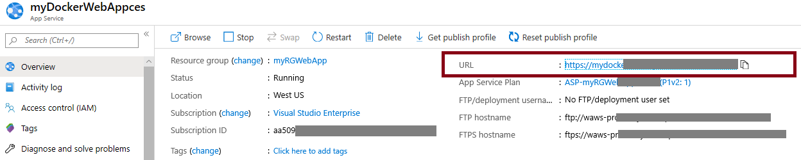

---
wts:
  title: 02 - Membuat Aplikasi Web (10 mnt)
  module: Module 02 - Core Azure Services (Workloads)
ms.openlocfilehash: 7b7acc368eff3c653579d54a12828e02a615a672
ms.sourcegitcommit: 26c283fffdd08057fdce65fa29de218fff21c7d0
ms.translationtype: HT
ms.contentlocale: id-ID
ms.lasthandoff: 01/27/2022
ms.locfileid: "137908145"
---
# 02 - Membuat Aplikasi Web (10 mnt)

Dalam panduan ini, kita akan membuat aplikasi web yang menjalankan kontainer Docker. Kontainer Docker menampilkan pesan Selamat Datang. 

Azure App Service sebenarnya adalah kumpulan dari empat layanan, yang semuanya dibuat untuk membantu Anda membuat host, dan menjalankan aplikasi web. Keempat layanan (Web Apps, Mobile Apps, API Apps, dan Logic Apps) terlihat berbeda, tetapi pada akhirnya semuanya beroperasi dengan cara yang sangat mirip. Web Apps adalah yang paling umum digunakan dari empat layanan, dan ini adalah layanan yang akan kita gunakan di lab ini.

# Tugas 1: Menciptakan Aplikasi Web 

Dalam tugas ini, Anda akan membuat Aplikasi Web Azure App Service. 

1. Masuk ke [portal Microsoft Azure](http://portal.azure.com/). 

2. Dari bilah **All service**, cari dan pilih **App Services**, lalu klik **+ Add, + Create, + New**

3. Pada tab **Basics** dari bilah **Web App**, tentukan pengaturan berikut (ganti **xxxx** dengan nama aplikasi web dengan huruf dan angka sehingga namanya unik secara global). Biarkan default untuk yang lainnya, termasuk App Service Plan. 

    | Pengaturan | Nilai |
    | -- | -- |
    | Langganan | **Menggunakan default yang disediakan** |
    | Grup Sumber Daya | **Membuat grup sumber daya baru**|
    | Nama | **myDockerWebAppxxxx** |
    | Terbitkan | **Kontainer Docker** |
    | Sistem Operasi | **Linux** |
    | Wilayah | **AS Timur** |
    
    **Catatan:** Perlu diingat untuk mengubah **xxxx** agar nama Aplikasi Web Anda unik.

4. Klik **Next > Docker** dan konfigurasikan informasi kontainer.  

    | Pengaturan | Nilai |
    | -- | -- |
    | Opsi | **Kontainer tunggal** |
    | Sumber Gambar | **Docker Hub** |
    | Jenis Akses | **Publik** |
    | Gambar dan tag | **mcr.microsoft.com/azuredocs/aci-helloworld** |
    
 **Catatan:** Perintah mulai adalah opsional dan tidak diperlukan dalam latihan ini.

5. Klik **Review + create**, lalu klk **Create**. 

# Tugas 2: Menguji Aplikasi Web

Dalam tugas ini, kita akan menguji aplikasi web.

1. Tunggu hingga Aplikasi Web disebarkan

2. Dari **Notifications**, klik **Go to resource**. 

3. Di bilah **Overview**, temukan **URL**. Salin URL ke papan klip.

    

4. DI jendela browser yang baru, tempelkan URL dan tekan enter. Selamat datang di Azure Container Instances! pesan selamat datang akan ditampilkan.

    

5. Beralih kembali ke bilah **Overview** aplikasi web dan gulir turun. Anda akan memperhatikan beberapa bagan pelacakan Data Masuk/Keluar dan Permintaan. Jika Anda mengulangi langkah 4 beberapa kali, Anda akan dapat melihat telemetri yang sesuai ditampilkan di bagan-bagan ini. Ini termasuk jumlah permintaan dan waktu respons rata-rata. 

**Catatan**: Untuk menghindari biaya tambahan, Anda dapat memilih untuk menghapus grup sumber daya ini. Telusuri grup sumber daya, klik grup sumber daya, lalu klik **Delete resource group**. Verifikasi nama grup sumber daya, lalu klik **Delete**. Pantau **Notifications** untuk melihat bagaimana proses penghapusan.

Selamat, Anda telah berhasil membuat Azure App Service.
