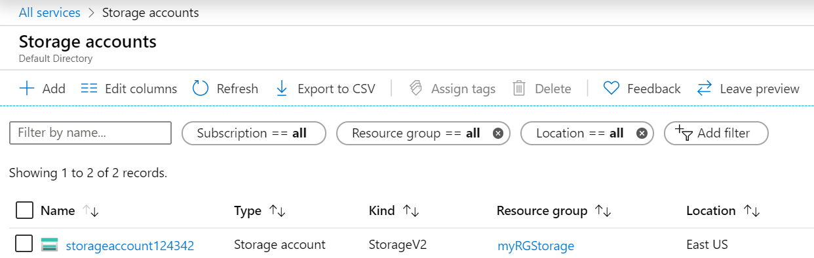
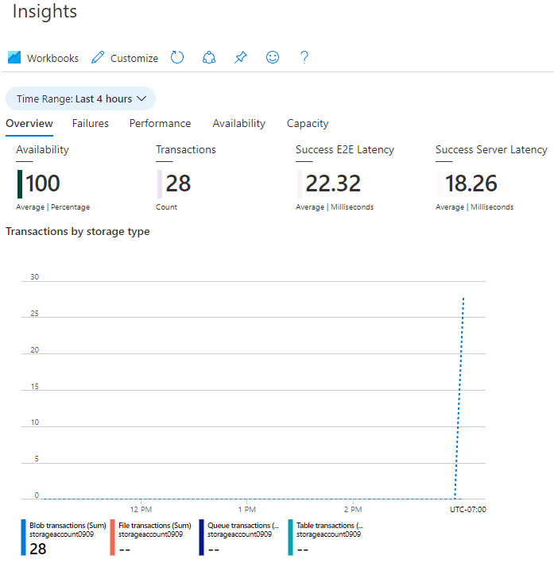

---
wts:
  title: 05 - Membuat penyimpanan blob (5 mnt)
  module: Module 02 - Core Azure Services (Workloads)
ms.openlocfilehash: 554a3eb1c95b354e836fe22541f00fa1eb0bc2de
ms.sourcegitcommit: 26c283fffdd08057fdce65fa29de218fff21c7d0
ms.translationtype: HT
ms.contentlocale: id-ID
ms.lasthandoff: 01/27/2022
ms.locfileid: "137908092"
---
# 05 - Membuat penyimpanan blob (5 mnt)

Dalam panduan ini, kita akan membuat akun penyimpanan, lalu bekerja dengan file penyimpanan blob.

# Tugas 1: Membuat akun penyimpanan 

Dalam tugas ini, kita akan membuat akun penyimpanan baru. 

1. Masuk ke portal Microsoft Azure di <a href="https://portal.azure.com" target="_blank">https://portal.azure.com</a>

2. Dari bilah **All services**, cari dan pilih **Storage accounts**, lalu klik **+ Add, + Create, + New**. 

3. Pada tab **Basics** bilah **Create storage account**, isi informasi berikut (ganti **xxxx** pada nama akun penyimpanan dengan huruf dan angka sedemikian rupa sehingga namanya unik secara global). Gunakan pengaturan default untuk yang lainnya.

    | Pengaturan | Nilai | 
    | --- | --- |
    | Langganan | **Biarkan default yang disediakan** |
    | Grup sumber daya | **Membuat grup sumber daya baru** |
    | Nama akun penyimpanan | **storageaccountxxxxx** |
    | Lokasi | **(AS) AS Timur**  |
    | Performa | **Standard** |
    | Redundansi | **Penyimpanan redundan secara lokal (LRS)** |
    
    **Catatan** - Perlu diingat untuk mengubah **xxxxx** agar menjadi **Nama akun penyimpanan** yang unik

5. Klik **Review + Create** untuk meninjau pengaturan akun penyimpanan Anda dan mengizinkan Azure untuk memvalidasi konfigurasi. 

6. Setelah divalidasi, klik **Create**. Tunggu pemberitahuan bahwa akun berhasil dibuat. 

7. Dari halaman Beranda, cari dan pilih **Storage accounts** dan pastikan akun penyimpanan baru Anda terdaftar.

    

# Tugas 2: Bekerja dengan penyimpanan blob

Dalam tugas ini, kita akan membuat kontainer Blob dan mengunggah file blob. 

1. Klik nama akun penyimpanan baru, gulir ke bagian **Data storage** di menu sebelah kiri, lalu klik **Containers**.

2. Klik **+ Container** dan lengkapi informasinya. Gunakan ikon Informasi untuk mempelajari lebih lanjut. Setelah selesai, klik **Create**.

    | Pengaturan | Nilai |
    | --- | --- |
    | Nama | **container1**  |
    | Tingkat akses publik| **Privat (tidak ada akses anonim)** |
  

    

4. Buka jendela browser yang baru dan cari **Bing** untuk gambar bunga. Klik kanan gambar dan simpanlah ke VM. 

6. Kembali ke Portal, klik **container1**, lalu pilih **Upload**.

5. Cari file gambar yang baru Anda simpan di komputer lokal. Pilih gambar itu, lalu pilih unggah.

   
6. Klik panah **Advanced**, biarkan nilai default tetapi tinjau opsi yang tersedia, lalu klik **Upload**.

    **Catatan**: Anda dapat mengunggah blob sebanyak yang Anda suka dengan cara ini. Blob baru akan dicantumkan di dalam kontainer.

7. Setelah file diunggah, klik kanan pada file dan perhatikan opsi termasuk Tampilkan/edit, Unduh, Properti, dan Hapus. 

8. Jika Anda punya waktu, tinjau opsi untuk File, Tables, dan Queues.

# Tugas 3: Memantau akun penyimpanan

1. Kembalilah ke bilah akun penyimpanan dan klik **Diagnose and solve problems**. 

2. Jelajahi beberapa masalah penyimpanan paling umum. Perhatikan bahwa ada beberapa pemecahan masalah di sini.

3. Di bilah akun penyimpanan, gulir turun ke bagian **Monitoring** dan klik **Insights**. Perhatikan bahwa ada informasi tentang Kegagalan, Performa, Ketersediaan, dan Kapasitas. Informasi Anda akan berbeda.

    

Selamat! Anda telah membuat akun penyimpanan, lalu bekerja dengan blob penyimpanan.

**Catatan**: Untuk menghindari biaya tambahan, Anda dapat memilih untuk menghapus grup sumber daya ini. Telusuri grup sumber daya, klik grup sumber daya, lalu klik **Delete resource group**. Verifikasi nama grup sumber daya, lalu klik **Delete**. Pantau **Notifications** untuk melihat bagaimana proses penghapusan.
