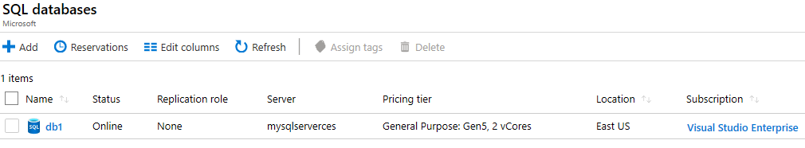

---
wts:
  title: 06 - Membuat database SQL (5 menit)
  module: Module 02 - Core Azure Services (Workloads)
ms.openlocfilehash: 61a0e7c7b54ed7cd13a9eae427a5b41abc51cffe
ms.sourcegitcommit: 26c283fffdd08057fdce65fa29de218fff21c7d0
ms.translationtype: HT
ms.contentlocale: id-ID
ms.lasthandoff: 01/27/2022
ms.locfileid: "137908129"
---
# <a name="06---create-a-sql-database-5-min"></a>06 - Membuat database SQL (5 menit)

Dalam panduan ini, kita akan membuat database SQL di Azure, lalu melakukan kueri data di database tersebut.

# <a name="task-1-create-the-database"></a>Tugas 1: Membuat database 

Dalam tugas ini, kita akan membuat database SQL berdasarkan database sampel AdventureWorksLT. 

1. Masuk ke portal Microsoft Azure di [ **https://portal.azure.com** ](https://portal.azure.com).

2. Dari bilah **All services**, cari dan pilih **SQL databases**, lalu klik **+ Add, + Create, + New**. 

3. Pada tab **Basics**, isi informasi ini.  

    | Pengaturan | Nilai | 
    | --- | --- |
    | Langganan | **Menggunakan default yang disediakan** |
    | Grup sumber daya | **Membuat grup sumber daya baru** |
    | Nama database| **db1** | 
    | Server | Pilih **Create new** (Bilah samping baru akan terbuka di sebelah kanan)|
    | Nama server | **sqlserverxxxx** (harus unik) | 
    | Lokasi | **(AS) AS Timur** |
    | Metode autentikasi | **Menggunakan autentikasi SQL** |
    | Nama masuk admin server | **sqluser** |
    | Kata sandi | **Pa$$w 0rd1234** |
    | Klik   | **OK** |

   

4. Di tab **Networking**, konfigurasikan pengaturan berikut (biarkan yang lain dengan nilai default) 

    | Pengaturan | Nilai | 
    | --- | --- |
    | Metode konektivitas | **Titik akhir publik** |    
    | Izinkan layanan dan sumber daya Azure untuk mengakses ruang kerja ini | **Ya** |
    | Tambahkan alamat IP klien saat ini | **Tidak** |
    
   

5. Di tab **Security**. 

    | Pengaturan | Nilai | 
    | --- | --- |
    | Microsoft Defender untuk SQL| **Jangan sekarang** |
    
6. Pindah ke tab **Additional settings**. Kita akan menggunakan database sampel AdventureWorksLT.

    | Pengaturan | Nilai | 
    | --- | --- |
    | Gunakan data yang sudah ada | **Sampel** |

    

7. Klik **Review + create**, lalu klik **Buat** untuk menyebarkan dan memprovisi grup sumber daya, server, dan database. Ini bisa memakan waktu sekitar 2 hingga 5 menit untuk menyebarkan.


# <a name="task-2-test-the-database"></a>Tugas 2: Menguji database.

Dalam tugas ini, kita akan mengonfigurasi server SQL dan menjalankan kueri SQL. 

1. Saat penyebaran telah selesai, klik Go to resource dari bilah penyebaran. Atau, dari bilah **All services**, cari dan pilih **Databases**, lalu **SQL databases** dan pastikan database yang baru telah dibuat. Anda mungkin perlu melakukan **Refresh** halamannya.

    

2. Klik entri **db1** yang mewakili database SQL yang telah Anda buat. Di bilah db1, klik **Query editor (preview)** .

3. Masuk sebagai **sqluser** dengan kata sandi **Pa$$w0rd1234**.

4. Anda tidak akan bisa masuk. Baca informasi kesalahan dengan cermat dan catat alamat IP yang perlu diizinkan melewati firewall. 

    

5. Kembali ke bilah **db1**, klik **Overview**. 

    

6. Dai bilah **Overview** db1, klik **Set server firewall** Ada di bagian tengah atas dari layar ikhtisar.

7. Klik **+ Add client IP** (bilah menu atas) untuk menambahkan alamat IP yang direferensikan dalam kesalahan. (ini mungkin telah diisi secara otomatis untuk Anda - jika tidak, tempelkan ke bidang alamat IP). Pastikan untuk **Menyimpan** perubahan Anda. 

    

8. Kembali ke database SQL (geser bilah di bawah ke arah kiri) dan klik **Query Editor (Preview)** . Coba masuk sebagai **sqluser** dengan kata sandi **Pa$$w0rd1234**. Kali ini Anda seharusnya berhasil masuk. Perhatikan bahwa mungkin perlu beberapa menit untuk menyebarkan aturan firewall baru. 

9. Setelah Anda berhasil masuk, panel kueri akan muncul. Masukkan kueri berikut ke dalam panel editor. 

    ```SQL
    SELECT TOP 20 pc.Name as CategoryName, p.name as ProductName
    FROM SalesLT.ProductCategory pc
    JOIN SalesLT.Product p
    ON pc.productcategoryid = p.productcategoryid;
    ```

    

10. Klik **Run**, lalu tinjau hasil kueri di panel **Results**. Kueri seharusnya berhasil dijalankan.

    

Selamat! Anda telah membuat database SQL di Azure dan berhasil membuat kueri data dalam database tersebut.

**Catatan**: Untuk menghindari biaya tambahan, Anda dapat memilih untuk menghapus grup sumber daya ini. Telusuri grup sumber daya, klik grup sumber daya, lalu klik **Delete resource group**. Verifikasi nama grup sumber daya, lalu klik **Delete**. Pantau **Notifications** untuk melihat bagaimana proses penghapusan.
