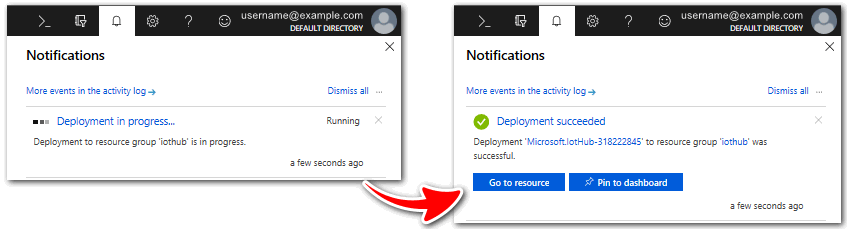
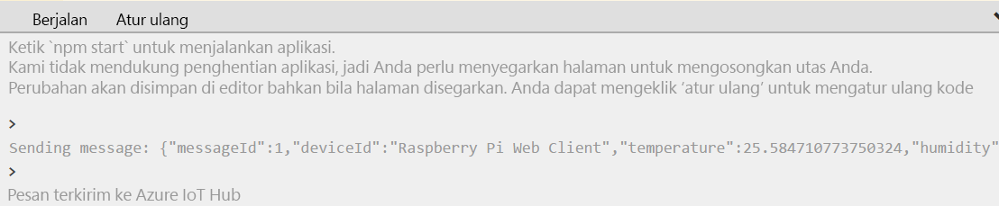
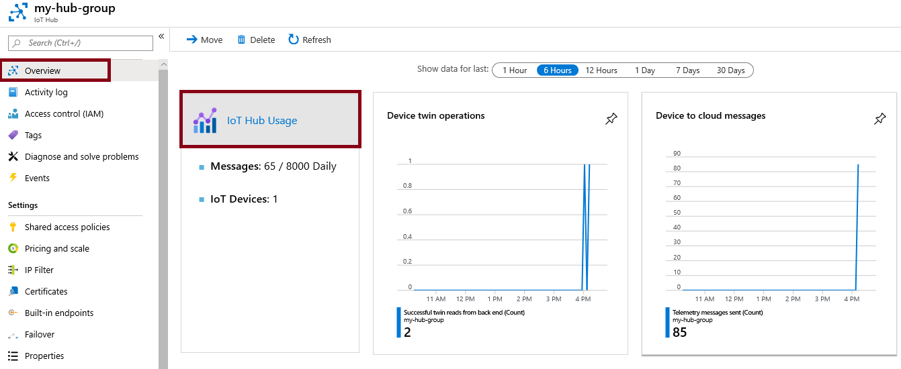

---
wts:
  title: 07 - Menerapkan Azure IoT Hub (10 mnt)
  module: 'Module 03: Describe core solutions and management tools'
ms.openlocfilehash: c2098875e07323c84eac8a405c8a59ad70eaabcd
ms.sourcegitcommit: 26c283fffdd08057fdce65fa29de218fff21c7d0
ms.translationtype: HT
ms.contentlocale: id-ID
ms.lasthandoff: 01/27/2022
ms.locfileid: "137908049"
---
# 07 - Menerapkan Azure IoT Hub (10 mnt)

Dalam panduan ini, kita akan mengonfigurasi Azure IoT Hub baru di Portal Microsoft Azure, lalu mengautentikasi koneksi ke perangkat IoT menggunakan simulator perangkat Raspberry Pi online. Data sensor dan pesan diteruskan dari simulator Raspberry Pi ke Azure IoT Hub, dan Anda melihat metrik untuk aktivitas pengiriman pesan di Portal Microsoft Azure.

# Tugas 1: Membuat IoT hub 

Dalam tugas ini, kita akan membuat IoT hub. 

1. Masuk ke [portal Microsoft Azure](https://portal.azure.com).

2. Dari bilah **All services**, cari dan pilih **IoT Hub**, lalu klik **+ Add, + Create, + New**.

3. Pada tab **Basics** dari bilah **IoT hub**, isi bidang dengan detail berikut (ganti **xxxx** dalam nama akun penyimpanan dengan huruf dan angka sehingga namanya unik secara global):

    | Pengaturan | Nilai |
    |--|--|
    | Langganan | **Biarkan default disediakan** |
    | Grup Sumber Daya | **Membuat grup sumber daya baru** |
    | Nama IoT Hub | **my-hub-groupxxxxx** |
    | Wilayah | **AS Timur** |

    **Catatan** - Perlu diingat untuk mengubah **xxxxx** sehingga menjadi **Nama IoT Hub** yang unik.

4. Buka tab **Manajemen**, dan gunakan tarik-turun untuk mengatur **Harga dan tingkat skala** ke **S1: Tingkat standar**.

5. Klik tombol **Tinjau + buat**.

6. Klik tombol **Create** untuk mulai membuat instans Azure IoT Hub baru.

7. Tunggu hingga instans Azure IoT Hub disebarkan. 

# Tugas 2: Menambahkan perangkat IoT

Dalam tugas ini, kita akan menambahkan perangkat IoT ke IoT hub. 

1. Saat penyebaran telah selesai, klik **Go to resource** dari bilah deployment. Atau, dari bilah **All services**, cari dan pilih **IoT Hub** dan temukan instans IoT Hub baru

    

2. Untuk menambahkan perangkat IoT baru, gulir ke bawah ke bagian **Manajemen perangkat** dan klik **Perangkat**. Kemudian, klik **+ Tambahkan Perangkat**.

    

3. Berikan nama untuk perangkat IoT yang baru, **myRaspberryPi**, dan klik tombol **Save**. Pemberian nama ini akan membuat identitas perangkat IoT baru di Azure IoT Hub.

4. Jika Anda tidak melihat perangkat baru, **Refresh** halaman Perangkat IoT. 

5. Pilih **myRaspberryPi** dan salin nilai **Primary Connection String**. Anda akan menggunakan kunci ini di tugas berikutnya untuk mengautentikasi koneksi ke simulator Raspberry Pi.

    

# Tugas 3: Menguji perangkat menggunakan Simulator Raspberry Pi

Dalam tugas ini, kita akan menguji perangkat menggunakan Simulator Raspberry Pi. 

1. Buka tab baru di browser web dan ketik tautan pintasan ini https://aka.ms/RaspPi. Anda akan dibawa ke situs Simulator Raspberry Pi. Jika Anda punya waktu, bacalah tentang simulator Raspberry Pi. Setelah selesai, pilih "**X**" untuk menutup jendela sembul.

2. Di area kode sebelah kanan, cari baris dengan 'const connectionString ='. Gantilah dengan string koneksi yang Anda salin dari portal Microsoft Azure. Perhatikan bahwa string koneksi mencakup entri DeviceId (**myRaspberryPi**) dan SharedAccessKey.

    

3. Klik **Run** (di bawah area kode) untuk menjalankan aplikasi. Output konsol harus menampilkan data sensor dan pesan yang dikirim dari simulator Raspberry Pi ke Azure IoT Hub. Data dan pesan dikirim setiap kali LED simulator Raspberry Pi berkedip. 

    

5. Klik **Stop** untuk berhenti mengirim data.

6. Kembali ke portal Microsoft Azure.

7. Alihkan bilah **Overview** IoT Hub dan gulir turun ke informasi **IoT Hub Usage** untuk melihat penggunaan. Ganti kerangka waktu di **show data for last** untuk melihat data dalam beberapa waktu terakhir.

    

Selamat! Anda telah menyiapkan Azure IoT Hub untuk mengumpulkan data sensor dari perangkat IoT.

**Catatan**: Untuk menghindari biaya tambahan, Anda dapat memilih untuk menghapus grup sumber daya ini. Telusuri grup sumber daya, klik grup sumber daya, lalu klik **Delete resource group**. Verifikasi nama grup sumber daya, lalu klik **Delete**. Pantau **Notifications** untuk melihat bagaimana proses penghapusan.
