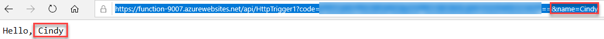

---
wts:
  title: 08 - Menerapkan Azure Functions (5 mnt)
  module: 'Module 03: Describe core solutions and management tools'
ms.openlocfilehash: 419d49832a4059e447d2621fe4f209dc5ada2474
ms.sourcegitcommit: 26c283fffdd08057fdce65fa29de218fff21c7d0
ms.translationtype: HT
ms.contentlocale: id-ID
ms.lasthandoff: 01/27/2022
ms.locfileid: "137907764"
---
# 08 - Menerapkan Azure Functions (5 mnt)

Dalam panduan ini, kita akan membuat Aplikasi Fungsi untuk menampilkan pesan Hello ketika ada permintaan HTTP. 

# Tugas 1: Membuat aplikasi Fungsi 

Dalam tugas ini, kita akan membuat aplikasi Fungsi.

1. Masuk ke [portal Microsoft Azure](https://portal.azure.com).

2. Di bilah **Search** di bagian atas portal, cari dan pilih **Function App**, lalu dari bilah **Function App**, klik **+ Add, + Create, + New**.

3. Pada tab **Basic** bilah **Function App**, tentukan pengaturan berikut (ganti **xxxx** dalam nama fungsi dengan huruf dan angka sehingga namanya unik secara global dan biarkan semua pengaturan lain dengan nilai default): 

    | Pengaturan | Nilai |
    | -- | --|
    | Langganan | **Biarkan default disediakan** |
    | Grup sumber daya | **Membuat grup sumber daya baru** |
    | Nama Aplikasi Fungsi | **function-xxxx** |
    | Terbitkan | **Kode** |
    | Tumpukan runtime | **.NET** |
    | Versi | **3.1** |
    | Wilayah | **AS Timur** |

    **Catatan** - Perlu diingat untuk mengubah **xxxx** sehingga menjadi **nama Aplikasi Fungsi** yang unik

4. Klik **Review + Create.** dan, setelah validasi berhasil, klik **Create** untuk mulai memprovisi dan menyebarkan Aplikasi Fungsi Azure yang baru.

5. Tunggu pemberitahuan bahwa sumber daya telah dibuat.

6. Saat penyebaran telah selesai, klik Go to resource dari bilah penyebaran. Atau, navigasi kembali ke bilah **Function App**, klik **Refresh** dan verifikasi bahwa aplikasi fungsi yang baru dibuat memiliki status **Running**. 

    

# Tugas 2: Membuat fungsi dan pengujian yang dipicu HTTP

Dalam tugas ini, kita akan menggunakan fungsi Webhook + API untuk menampilkan pesan saat ada permintaan HTTP. 

1. Pada bilah **Function App**, klik aplikasi fungsi yang baru dibuat. 

2. Di bilah aplikasi fungsi, di bagian **Functions**, klik **Functions**, lalu klik **+ Add, + Create, + New**.

    

3. Jendela pop-up **Add function** akan muncul di sebelah kanan. Di bagian **Select a template**, klik **HTTP trigger**. Klik **Tambahkan** 

    

4. Pada bilah **HttpTrigger1**, di bagian **Developer**, klik **Code + Test**. 

5. Di bilah **Code + Test**, tinjau kode yang dibuat secara otomatis dan perhatikan bahwa kode tersebut dirancang untuk menjalankan permintaan HTTP dan informasi log. Selain itu, perhatikan fungsi menampilkan pesan Hello dengan sebuah nama. 

    

6. Klik **Get function URL** dari bagian atas editor fungsi. 

7. Pastikan nilai dalam daftar menurun **Key** diatur ke **default** dan klik **Copy** untuk menyalin fungsi URL. 

    

8. Buka tab browser baru dan tempel URL fungsi yang disalin ke bilah alamat browser web Anda. Ketika halaman diminta, fungsi akan berjalan. Perhatikan pesan yang dikembalikan yang menyatakan bahwa fungsi tersebut memerlukan nama di isi permintaan.

    

9. Tambahkan **&name=*yourname*** di akhir URL.

    **Catatan**: Misalnya, jika nama Anda Cindy, URL akhir akan terlihat seperti berikut: `https://azfuncxxx.azurewebsites.net/api/HttpTrigger1?code=X9xx9999xXXXXX9x9xxxXX==&name=cindy`

    

10. Saat Anda menekan enter, fungsi akan berjalan dan setiap permohonan akan dilacak. Untuk melihat jejak, kembali ke panel Portal **HttpTrigger1 \| Kode + Pengujian** dan klik **Pantau**. Anda dapat **mengonfigurasi** Application Insights dengan memilih stempel waktu dan mengeklik **Jalankan kueri di Application Insights**.

     

Selamat! Anda telah membuat Aplikasi Fungsi untuk menampilkan pesan Halo ketika ada permintaan HTTP.  

**Catatan**: Untuk menghindari biaya tambahan, Anda dapat memilih untuk menghapus grup sumber daya ini. Telusuri grup sumber daya, klik grup sumber daya, lalu klik **Delete resource group**. Verifikasi nama grup sumber daya, lalu klik **Delete**. Pantau **Notifications** untuk melihat bagaimana proses penghapusan.
