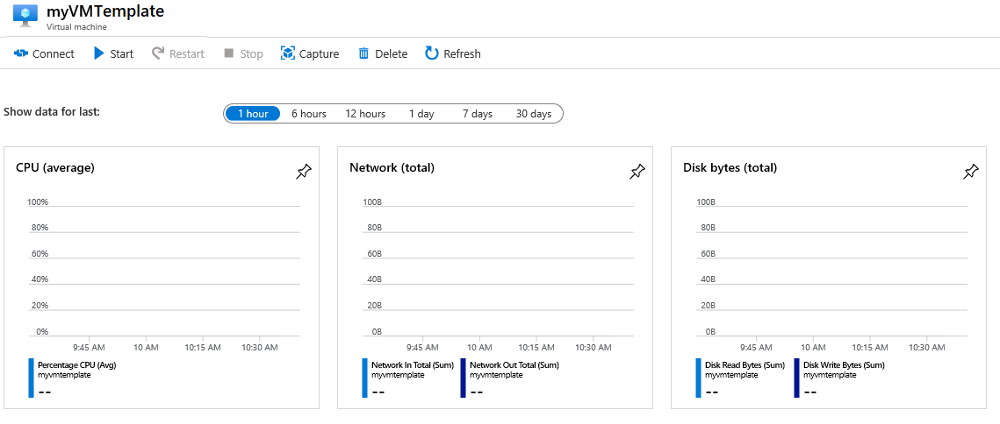

---
wts:
  title: 09 - Membuat VM dengan Templat (10 mnt)
  module: 'Module 03: Describe core solutions and management tools'
ms.openlocfilehash: d4d29b62fc5dfa2e050ac51fcf4d5067e8fd3283
ms.sourcegitcommit: 26c283fffdd08057fdce65fa29de218fff21c7d0
ms.translationtype: HT
ms.contentlocale: id-ID
ms.lasthandoff: 01/27/2022
ms.locfileid: "137908028"
---
# 09 - Membuat VM dengan Templat (10 mnt)

Dalam panduan ini, kita akan menyebarkan komputer virtual dengan templat QuickStart dan memeriksa kemampuan pemantauan.

# Tugas 1: Menjelajahi galeri QuickStart dan menemukan templat 

Dalam tugas ini, kita akan menelusuri galeri Azure QuickStart dan menyebarkan templat yang membuat komputer virtual. 

1. Dalam lingkungan lab, buka jendela browser baru, dan masukkan T https://azure.microsoft.com/en-us/resources/templates/?azure-portal=true. Di galeri, Anda akan menemukan sejumlah templat populer dan baru-baru ini diperbarui. Templat ini mengotomatiskan penyebaran sumber daya Azure, termasuk penginstalan paket perangkat lunak populer. Telusuri berbagai jenis templat yang tersedia.

3. Pilih **Deploy a simple Windows VM**

4. Klik tombol **Sebarkan ke Azure**. Sesi browser Anda akan secara otomatis dialihkan ke [portal Microsoft Azure](http://portal.azure.com/).

  **Catatan**: Tombol **Deploy to Azure** memungkinkan Anda menerapkan templat melalui portal Microsoft Azure. Selama penyebaran tersebut, Anda hanya akan diminta untuk sejumlah kecil parameter konfigurasi. 

5. Saat diminta, masuk ke langganan Azure Anda menggunakan kredensial yang diberikan sebelumnya dalam instruksi.

6. Klik **Edit template**. Format templat Resource Manager menggunakan format JSON. Tinjau parameter dan variabel.  Lalu temukan parameter untuk nama komputer virtual. Ubah nama menjadi **myVMTemplate**. **Simpan** perubahan Anda. 

    

7. Sekarang konfigurasikan parameter yang diperlukan oleh templat (ganti ***xxxx*** di prefiks label DNS dengan huruf dan angka sehingga label unik secara global). Gunakan pengaturan default untuk yang lainnya. 

    | Pengaturan| Nilai|
    |----|----|
    | Langganan | **Biarkan default disediakan**|
    | Grup sumber daya | **Membuat grup sumber daya baru** |
    | Wilayah | Tetap default |
    | Nama Pengguna Admin | **azureuser** |
    | Admin password | **Pa$$w 0rd1234** |
    | DNS label prefix | **myvmtemplatexxxx** |
    | Versi OS | **2019-Pusat Data** |

9. Klik **Tinjau + Buat**.

10. Pantau penyebarannya. 

# Tugas 2: Memverifikasi dan memantau penyebaran komputer virtual Anda

Dalam tugas ini, kita akan memastikan komputer virtual telah disebarkan dengan benar. 

1. Dari bilah **All services**, cari dan pilih **Virtual machines**.

2. Pastikan komputer virtual baru Anda telah dibuat. 

    

3. Pilih komputer virtual Anda dan di panel **Overview**, pilih tab **Monitoring**, gulir turun untuk melihat data pemantauan.

    **Catatan**: Jangka waktu pemantauan dapat disesuaikan mulai dari satu jam hingga 30 hari.

4. Tinjau bagan berbeda yang disediakan termasuk **CPU (average)** , **Network (total)** , dan **Disk bytes (total)** . 

    

5. Klik di bagan mana saja. Perhatikan bahwa Anda dapat **Menambahkan metrik** dan mengubah jenis bagan.

6. Kembali ke panel **Gambaran Umum**. (geser bilah ke kiri)
7. Klik **Activity log** (panel sebelah kiri). Log aktivitas merekam peristiwa seperti pembuatan atau pengubahan sumber daya. 

8. Klik **Add filter**, dan lakukan eksperimen dengan menelusuri berbagai jenis dan operasi peristiwa. 

    

Selamat! Anda telah berhasil membuat sumber daya dari templat dan menyebarkan templat itu ke Azure.

**Catatan**: Untuk menghindari biaya tambahan, Anda dapat memilih untuk menghapus grup sumber daya ini. Telusuri grup sumber daya, klik grup sumber daya, lalu klik **Delete resource group**. Verifikasi nama grup sumber daya, lalu klik **Delete**. Pantau **Notifications** untuk melihat bagaimana proses penghapusan.
