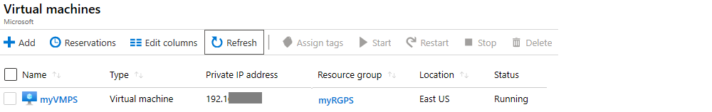

---
wts:
  title: 10 - Membuat VM dengan PowerShell (10 mnt)
  module: 'Module 03: Describe core solutions and management tools'
ms.openlocfilehash: a6c6e26b535658ebb01beac8037adcb5c15dc6e8
ms.sourcegitcommit: 26c283fffdd08057fdce65fa29de218fff21c7d0
ms.translationtype: HT
ms.contentlocale: id-ID
ms.lasthandoff: 01/27/2022
ms.locfileid: "137907756"
---
# <a name="10---create-a-vm-with-powershell-10-min"></a>10 - Membuat VM dengan PowerShell (10 mnt)

Dalam panduan ini, kita akan mengonfigurasi Cloud Shell, menggunakan modul Azure PowerShell untuk membuat grup sumber daya dan komputer virtual, serta meninjau rekomendasi Azure Advisor. 

# <a name="task-1-configure-the-cloud-shell"></a>Tugas 1: Mengonfigurasi Cloud Shell 

Dalam tugas ini, kita akan mengonfigurasi Cloud Shell. 

1. Masuk ke [portal Microsoft Azure](https://portal.azure.com).** Anda dapat menemukan kredensial masuk Anda di dalam tab sumber daya (tepat di sebelah tab Instruksi ini!) **
2. Dari portal Microsoft Azure, buka **Azure Cloud Shell** dengan mengklik ikon di sebelah kanan atas Portal Microsoft Azure.

    

3. Saat diminta untuk memilih **Bash** atau **PowerShell**, pilih **PowerShell**.

4. Di layar **You have no storage mounted**, pilih **Show advanced settings**, lalu isikan informasi berikut

    | Pengaturan | Nilai |
    |  -- | -- |
    | Grup Sumber Daya | **Membuat grup sumber daya baru** |
    | Storage account: (Buat akun baru menggunakan nama yang unik secara global (mis.cloudshellstoragemystorage)) | **cloudshellxxxxxxx** |
    | File share (buat yang baru) | **shellstorage** |

5. Pilih **Create Storage**

# <a name="task-2-create-a-resource-group-and-virtual-machine"></a>Tugas 2: Membuat grup sumber daya dan komputer virtual

Dalam tugas ini, kita akan menggunakan PowerShell untuk membuat grup sumber daya dan komputer virtual.  

1. Pastikan **PowerShell** dipilih di menu menurun di sebelah kiri atas panel Cloud Shell.

2. Verifikasi grup sumber daya Anda dengan menjalankan perintah berikut di jendela Powershell. Tekan **Enter** untuk menjalankan perintah.

    ```PowerShell
    Get-AzResourceGroup | Format-Table
    ```

3. Buat komputer virtual. Dengan menempelkan perintah berikut ke jendela terminal. 

    ```PowerShell
    New-AzVm `
    -ResourceGroupName "myRGPS" `
    -Name "myVMPS" `
    -Location "East US" `
    -VirtualNetworkName "myVnetPS" `
    -SubnetName "mySubnetPS" `
    -SecurityGroupName "myNSGPS" `
    -PublicIpAddressName "myPublicIpPS"
    ```
    
4. Saat diminta, berikan nama pengguna (**azureuser**) dan kata sandi (**Pa$$w0rd1234**) yang akan dikonfigurasi sebagai akun Administrator lokal pada mesin virtual tersebut.azureadmin

5. Setelah VM dibuat, tutup panel Cloud Shell sesi PowerShell.

6. Di portal Microsoft Azure, cari **Virtual machines** dan pastikan bahwa **myVMPS** sedang berjalan. Ini mungkin perlu waktu beberapa menit.

    

7. Akses komputer virtual baru dan tinjau pengaturan Overview dan Networking untuk memastikan bahwa informasi Anda telah disebarkan dengan benar. 

# <a name="task-3-execute-commands-in-the-cloud-shell"></a>Tugas 3: Menjalankan perintah di Cloud Shell

Dalam tugas ini, kita akan berlatih menjalankan perintah PowerShell dari Cloud Shell. 

1. Dari portal Microsoft Azure, buka **Azure Cloud Shell** dengan mengklik ikon di sebelah kanan atas Portal Microsoft Azure.

2. Pastikan **PowerShell** dipilih di menu menurun di sebelah kiri atas panel Cloud Shell.

3. Ambil informasi tentang komputer virtual Anda termasuk nama, grup sumber daya, lokasi, dan status. Perhatikan PowerState sedang **berjalan**.

    ```PowerShell
    Get-AzVM -name myVMPS -status | Format-Table -autosize
    ```

4. Hentikan komputer virtual. Menggunakan perintah berikut. 

    ```PowerShell
    Stop-AzVM -ResourceGroupName myRGPS -Name myVMPS
    ```
5. Ketika diminta, konfirmasi (Yes) untuk tindakan tersebut. Tunggulah status **Succeeded**.

6. Pastikan status komputer virtual Anda. PowerState sekarang semestinya **dibatalkan alokasinya**. Anda juga dapat memastikan status komputer virtual di portal. Tutup Cloudshell.

    ```PowerShell
    Get-AzVM -name myVMPS -status | Format-Table -autosize
    ```

# <a name="task-4-review-azure-advisor-recommendations"></a>Tugas 4: Meninjau Rekomendasi Azure Advisor

**Catatan:** Tugas yang sama ini ada di lab Membuat VM dengan Azure CLI. 

Dalam tugas ini, kita akan meninjau rekomendasi Azure Advisor untuk komputer virtual. 

1. Dari bilah **All services**, cari dan pilih **Advisor**. 

2. Di bilah **Advisor**, pilih **Overview**. Rekomendasi pemberitahuan dikelompokkan berdasarkan Keandalan, Keamanan, Performa, dan Biaya. 

    

3. Pilih **All recommendations** dan luangkan waktu untuk melihat setiap rekomendasi dan tindakan yang disarankan. 

    **Catatan:** Bergantung pada sumber daya Anda, rekomendasinya akan berbeda. 

    

4. Perhatikan bahwa Anda dapat mengunduh rekomendasi sebagai file CSV atau PDF. 

5. Perhatikan bahwa Anda dapat membuat peringatan. 

6. Jika Anda memiliki waktu, lanjutkan bereksperimen dengan Azure PowerShell. 

Selamat! Anda telah mengonfigurasi Cloud Shell, membuat komputer virtual menggunakan PowerShell, berlatih dengan perintah PowerShell, dan melihat rekomendasi Advisor.

**Catatan**: Untuk menghindari biaya tambahan, Anda dapat memilih untuk menghapus grup sumber daya ini. Telusuri grup sumber daya, klik grup sumber daya, lalu klik **Delete resource group**. Verifikasi nama grup sumber daya, lalu klik **Delete**. Pantau **Notifications** untuk melihat bagaimana proses penghapusan.
