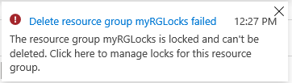

---
wts:
  title: 15 - Mengelola kunci sumber daya (5 mnt)
  module: 'Module 05: Describe identity, governance, privacy, and compliance features'
ms.openlocfilehash: 47c915f02f041a8af82057e95069b3cf9f73704c
ms.sourcegitcommit: 26c283fffdd08057fdce65fa29de218fff21c7d0
ms.translationtype: HT
ms.contentlocale: id-ID
ms.lasthandoff: 01/27/2022
ms.locfileid: "137907956"
---
# 15 - Mengelola kunci sumber daya (5 mnt)

Dalam panduan ini, kita akan menambahkan kunci ke grup sumber daya dan menguji menghapus grup sumber daya. Kunci dapat diterapkan dalam langganan ke grup sumber daya, atau sumber daya individu untuk mencegah penghapusan atau pengubahan sumber daya penting yang tidak disengaja.  

# Tugas 1:  Menambahkan Kunci ke grup sumber daya dan menguji penghapusan

Dalam tugas ini, kita akan menambahkan kunci sumber daya ke grup sumber daya dan menguji menghapus grup sumber daya. 

1. Masuk ke [portal Microsoft Azure](https://portal.azure.com).

2. Di portal Microsoft Azure, navigasi grup sumber daya yang baru dibuat **myRGLocks**.

3. Anda dapat menerapkan kunci ke langganan, grup sumber daya, atau sumber daya individu untuk mencegah penghapusan atau pengubahan sumber daya penting yang tidak disengaja. 

4. Di bagian **Pengaturan**, klik **Kunci**, lalu klik **+ Tambahkan**. 

    

5. Konfigurasikan kunci baru. Setelah selesai, klik **OK**. 

    | Pengaturan | Nilai |
    | -- | -- |
    | Nama kunci | '''RGLock''' |
    | Lock Type | **Hapus** |
    | | |

6. Klik **Overview** dan klik **Delete resource group**. Ketik nama grup sumber daya dan klik **OK**. Anda menerima pesan kesalahan yang menyatakan bahwa grup sumber daya terkunci dan tidak dapat dihapus.

    

# Tugas 2: Menguji menghapus anggota grup sumber daya.

Dalam tugas ini, kita akan menguji apakah kunci sumber daya melindungi akun penyimpanan di grup sumber daya. 

1. Dari bilah **All services**, cari dan pilih **Storage accounts**, lalu klik **+ Add, + Create, atau + New**. 

2. Pada halaman **Akun Penyimpanan** panel **+Tambahkan +Baru +Buat **, isi informasi berikut (ganti **xxxx** nama akun penyimpanan dengan huruf dan angka sehingga nama unik secara global). Gunakan pengaturan default untuk yang lainnya.

    | Pengaturan | Nilai | 
    | --- | --- |
    | Langganan | **Pilih langganan Anda** |
    | Grup sumber daya | **myRGLocks** |
    | Nama akun penyimpanan | **storageaccountxxxx** |
    | Lokasi | **(AS) AS Timur**  |
    | Performa | **Standard** |
    | Jenis akun | **StorageV2 (V2 serbaguna)** |
    | Replikasi | **Penyimpanan redundan secara lokal (LRS)** |
    | Tingkat akses (default) | **Populer** |
   

3. Klik **Review + Create** untuk meninjau pengaturan akun penyimpanan Anda dan mengizinkan Azure untuk memvalidasi konfigurasi. 

4. Setelah divalidasi, klik **Create**. Tunggu pemberitahuan bahwa akun berhasil dibuat. 

5.  Tunggu pemberitahuan bahwa akun penyimpanan berhasil dibuat. 

6. Akses akun penyimpanan baru Anda dan dari panel **Overview**, klik **Delete**. Anda menerima pesan kesalahan yang menyatakan sumber daya atau induknya memiliki kunci hapus. 

    

    **Catatan**: Meskipun kita tidak membuat kunci khusus untuk akun penyimpanan, kita membuat kunci di tingkat grup sumber daya, yang berisi akun penyimpanan. Dengan demikian, kunci tingkat *induk* ini mencegah kita menghapus sumber daya dan akun penyimpanan mewarisi kunci dari induknya.

# Tugas 3: Menghapus kunci sumber daya.

Dalam tugas ini, kita akan menghapus kunci sumber daya dan mengujinya. 

1. Kembali ke bilah grup sumber daya **myRGLocks-XXXXXXXX** dan, di bagian **Settings**, Klik **Locks**.
    
2. Klik tautan **Delete** di ujung kanan entri **myRGLocks-XXXXXXXX**, di sebelah kanan **Edit**.

    

3. Kembali ke bilah akun penyimpanan dan konfirmasikan bahwa Anda sekarang dapat menghapus sumber daya.

Selamat! Anda membuat grup sumber daya, menambahkan kunci ke grup sumber daya dan menguji penghapusan, menguji menghapus sumber daya di grup sumber daya, dan menghapus kunci sumber daya. 

**Catatan**: Untuk menghindari biaya tambahan, Anda dapat memilih untuk menghapus grup sumber daya ini. Telusuri grup sumber daya, klik grup sumber daya, lalu klik **Delete resource group**. Verifikasi nama grup sumber daya, lalu klik **Delete**. Pantau **Notifications** untuk melihat bagaimana proses penghapusan.
