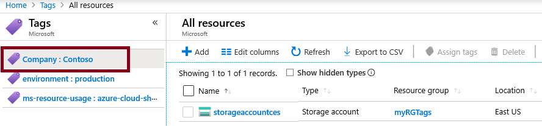
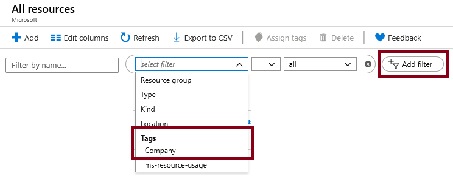

---
wts:
  title: 16 - Menerapkan pemberian tag sumber daya (5 mnt)
  module: 'Module 05: Describe identity, governance, privacy, and compliance features'
ms.openlocfilehash: cc7a298eb03be3dfcbcc1c69cfa7409bc94c0640
ms.sourcegitcommit: dfe52fea15c568547ba630e9b337ec8df957ad80
ms.translationtype: HT
ms.contentlocale: id-ID
ms.lasthandoff: 02/25/2022
ms.locfileid: "139213865"
---
# 16 - Menerapkan pemberian tag sumber daya (5 mnt)

Dalam panduan ini, kita akan membuat penugasan kebijakan yang memerlukan pemberian tag, membuat akun penyimpanan dan menguji pemberian tag, menampilkan sumber daya dengan tag tertentu, dan menghapus kebijakan pemberian tag.

# Tugas 1: Membuat penetapan Kebijakan 

Dalam tugas ini, kita akan mengonfigurasi kebijakan **Membutuhkan tag pada sumber daya** dan menetapkannya ke langganan kita. 

1. Masuk ke [portal Microsoft Azure](https://portal.azure.com).

2. Dari bilah **All services**, cari dan pilih **Policy**.

3. Gulir ke bawah ke bagian **Authoring**, klik **Assignments**, lalu klik **Assign Policy** di bagian atas halaman.

4. Perhatikan **Cakupan** untuk kebijakan akan menjadi langganan yang luas. 

5. Di bawah **Basics**, pilih tombol elipsis **Policy definition** (sisi kanan kotak teks). Di kotak **Search**, masukkan **tag** nilai. Daftar Kebijakan yang terkait dengan **tag** kata akan muncul. Gulir ke bawah hingga Anda menemukan definisi **Memerlukan tag dan nilainya pada sumber daya**, klik lalu **Pilih**.

   
   
6.  Pada tab **Parameter**, ketik **Company : Contoso ** untuk nama pasangan kunci/nilai tag. Klik **Review + create.** , lalu klk **Create**.

  

7. Penetapan kebijakan **Memerlukan tag dan nilainya pada sumber daya** sekarang sudah diterapkan. Saat sumber daya dibuat, sumber daya tersebut harus menyertakan tag dengan Company: Kunci contoso.
   **Catatan - Anda harus menunggu hingga 30 menit agar Kebijakan diterapkan.** 

  

# Tugas 2: Membuat akun penyimpanan untuk menguji pemberian tag yang diperlukan.

Dalam tugas ini, kita akan membuat akun penyimpanan untuk menguji pemberian tag yang diperlukan. 

1. Di Portal Microsoft Azure, dari bilah **All services**, cari dan pilih **Storage accounts**, lalu klik **+Add +New +Create**.

2. Pada tab **Basics** bilah **Create storage account**, isi informasi berikut (ganti **xxxx** pada nama akun penyimpanan dengan huruf dan angka sedemikian rupa sehingga namanya unik secara global). Gunakan pengaturan default untuk yang lainnya.

    | Pengaturan | Nilai | 
    | --- | --- |
    | Langganan | **Gunakan default yang disediakan** |
    | Grup sumber daya | **Membuat grup sumber daya baru** |
    | Nama akun penyimpanan | **storageaccountxxxx** |
    | Lokasi | **(AS) AS Timur** |

3. Klik **Ulas + buat**. 

    **Catatan:** Kita sedang menguji untuk melihat apa yang terjadi jika tag tidak diberikan. Harap diperhatikan, mungkin perlu waktu hingga 30 menit agar Kebijakan selesai diterapkan.

4. Anda akan menerima pesan Validasi gagal. Klik pesan **Click here to view details**. Di bilah **Errors** pada tab **Summary**, perhatikan pesan kesalahan yang menyatakan bahwa sumber daya tidak diizinkan oleh Kebijakan.

    **Catatan:** Jika Anda melihat tab Raw Error, Anda akan melihat nama tag spesifik yang diperlukan. 

    

5. Tutup panel **Error** dan klik **Previous** (bagian bawah layar). Berikan informasi pemberian tag. 

    | Pengaturan | Nilai | 
    | --- | --- |
    | Nama tag | **Company:Contoso** (mungkin tidak ada dalam daftar drop-down) |

6. Klik **Review + create.** dan periksa bahwa validasi berhasil. Klik **Create** untuk menyebarkan akun penyimpanan. 

# Tugas 3: Menampilkan semua sumber daya dengan tag tertentu.

1. Di Portal Microsoft Azure, dari bilah **All services**, cari dan pilih **Tags**.

2. Catat semua tag dan nilainya. Klik **Perusahaan: Contoso** pasangan kunci/nilai. Ini akan menampilkan bilah yang menunjukkan akun penyimpanan yang baru dibuat, selama Anda menyertakan tag selama penyebarannya. 

   

3. Di Portal, tampilkan bilah **All resources**.

4. Klik **Add filter** dan tambahkan kunci tag **Company** sebagai kategori filter. Dengan filter diterapkan, hanya akun penyimpanan Anda yang akan dicantumkan.

    

# Tugas 4: Hapus penetapan kebijakan

Dalam tugas ini, kita akan menghapus kebijakan **Membutuhkan tag pada sumber daya** sehingga tidak memengaruhi pekerjaan kita di masa depan. 

1. Di Portal Microsoft Azure, dari bilah **All services**, cari dan pilih **Policy**.

2. Klik entri kebijakan **Require a tag on resources**.

3. Klik **Delete Assignment** di menu bagian atas.

4. Konfirmasikan bahwa Anda ingin menghapus penugasan kebijakan di dialog **Delete assignment** dengan mengklik **Yes**

5. Jika Anda punya waktu, buat sumber daya lain tanpa tag untuk memastikan kebijakan tidak lagi berlaku.

Selamat! Dalam panduan ini, kita membuat penetapan kebijakan yang memerlukan pemberian tag, membuat sumber daya (akun penyimpanan) dan menguji Kebijakan untuk pemberian tag, menampilkan sumber daya dengan tag tertentu, serta menghapus kebijakan pemberian tag.

**Catatan**: Untuk menghindari biaya tambahan, Anda dapat memilih untuk menghapus grup sumber daya ini. Telusuri grup sumber daya, klik grup sumber daya, lalu klik **Delete resource group**. Verifikasi nama grup sumber daya, lalu klik **Delete**. Pantau **Notifications** untuk melihat bagaimana proses penghapusan.
