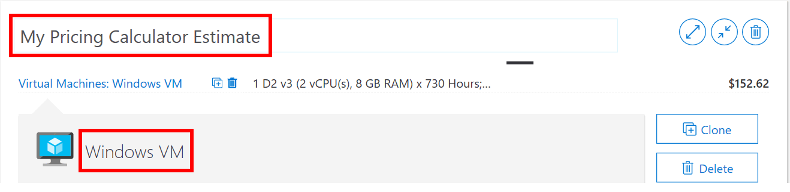
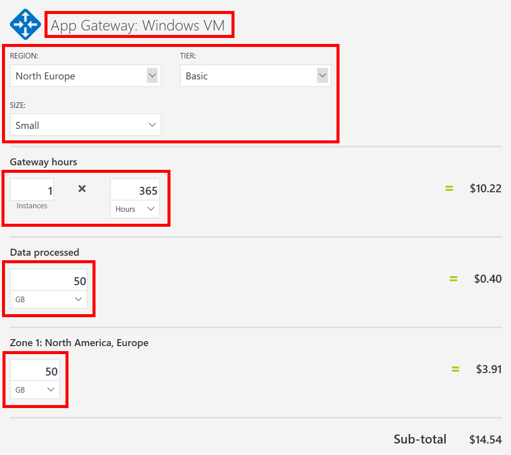

---
wts:
  title: 19 - Menggunakan Kalkulator Harga Azure (10 mnt)
  module: 'Module 06: Describe Azure cost management and service level agreements'
ms.openlocfilehash: 9b071ca3caa80cc8f78541a61010b5b2d0fe8053
ms.sourcegitcommit: 26c283fffdd08057fdce65fa29de218fff21c7d0
ms.translationtype: HT
ms.contentlocale: id-ID
ms.lasthandoff: 01/27/2022
ms.locfileid: "137907873"
---
# 19 - Menggunakan Kalkulator Harga (10 mnt)

Dalam panduan ini, kita akan menggunakan Kalkulator Harga Azure untuk membuat perkiraan biaya komputer virtual Azure dan sumber daya jaringan terkait.

# Tugas 1: Mengonfigurasi kalkulator harga

Dalam tugas ini, kita akan memperkirakan biaya infrastruktur sampel menggunakan Kalkulator Harga Azure. 

**Catatan**: Untuk membuat perkiraan Kalkulator Harga Azure, panduan ini memberikan contoh konfigurasi komputer virtual dan sumber daya terkait. Gunakan contoh konfigurasi ini atau berikan Kalkulator Harga Azure dengan detail kebutuhan sumber daya Anda yang *sebenarnya*.

1. Di browser, navigasikan ke halaman web [Kalkulator Harga Azure](https://azure.microsoft.com/en-us/pricing/calculator/).

2. Untuk menambahkan detail konfigurasi komputer virtual Anda, klik **Virtual Machines** pada tab **Products**. Gulir ke bawah untuk melihat detail komputer virtual. 

3. Ganti **Your Estimate** dan teks **Virtual Machines** dengan nama yang lebih deskriptif untuk perkiraan Kalkulator Harga Azure dan konfigurasi komputer virtual Anda. Contoh panduan ini menggunakan **My Pricing Calculator Estimate** untuk perkiraan, dan **Windows VM** untuk konfigurasi komputer virtual.

   

4. Ubah konfigurasi komputer virtual default.

    | Pengaturan | Nilai |
    | -- | -- |
    | Wilayah | **Eropa Utara** |
    | Sistem Operasi | **Windows** |
    | Jenis | **(khusus OS)** |
    | Tingkat | **Standard** |  
    | Instans | **A2: 2 Core(s), 3,5 GB RAM, 135 GB Penyimpanan sementara** |

   

    **Catatan**: Spesifikasi dan harga instans VM mungkin berbeda dari yang ada dalam contoh ini. Ikuti panduan ini dengan memilih instans yang sedekat mungkin dengan contoh. Untuk menampilkan detail tentang berbagai opsi produk VM, pilih **Product details** dari menu **More info** di sebelah kanan.

5. Atur **Billing Option** ke **Pay as you go**.

   

6. Di Azure, satu bulan didefinisikan sebagai 730 jam. Jika Mesin Virtual Anda harus tersedia 100 persen setiap bulan, Anda mengatur nilai jam per bulan ke `730`. Contoh panduan ini mengharuskan satu VM tersedia 50 persen dari waktu setiap bulan.

    Biarkan jumlah Mesin Virtual ditetapkan pada `1`, dan ubah nilai jam per bulan menjadi `365`.

   

7. Di panel **Managed OS Disks**, ubah konfigurasi penyimpanan VM default.

    | Tingkat | Ukuran disk | Jumlah disk | Snapshot | Transaksi penyimpanan |
    | ---- | --------- | --------------- | -------- | -------------------- |
    | HDD Standar | S30: 1024 GiB | 1 | Nonaktif | 10.000 |

   

8. Untuk menambahkan bandwidth jaringan ke perkiraan Anda, buka bagian atas halaman web Kalkulator Harga Azure. Klik **Networking** di menu produk di sebelah kiri, lalu klik petak **Bandwidth**. Dalam dialog pesan **Bandwidth added**, klik **View**.

   

9. Tambahkan nama untuk konfigurasi bandwidth komputer virtual Anda. Contoh panduan ini menggunakan nama **Bandwidth: Mesin Virtual Windows**. Ubah konfigurasi bandwidth default dengan menambahkan detail berikut.

    | Wilayah | Zone 1 Outbound Data Transfer Amount |
    | ------ | -------------------------------------- |
    | Eropa Utara | 50 GB |

   

10. Untuk menambahkan Application Gateway, kembali ke bagian atas halaman web Kalkulator Harga Azure. Di menu produk **Networking**, klik petak **Application Gateway**. Dalam dialog pesan **Application Gateway**, klik **View**.

    

11. Tambahkan nama untuk konfigurasi Application Gateway. Panduan ini menggunakan nama **App Gateway: Mesin Virtual Windows**. Ubah konfigurasi Application Gateway default dengan menambahkan detail berikut.

    | Pengaturan | Nilai |
    | -- | -- |
    | Wilayah | **Eropa Utara** |
    | Tingkat | **Dasar** |
    | Ukuran | **Kecil** |
    | Instans | **1** |  
    | Jam | **365** |
    | Data yang diproses | **50 GB** |
    | Zone 1: North America, Europe | **50 GB**|

    

# Tugas 2: Meninjau perkiraan harga

Dalam tugas ini, kita akan meninjau hasil Kalkulator Harga Azure. 

1. Gulir ke bagian bawah halaman web Kalkulator Harga Azure untuk menampilkan total **Perkiraan biaya bulanan**.

    **Catatan**: Jelajahi berbagai opsi yang tersedia dalam Kalkulator Harga Azure. Misalnya, panduan ini mengharuskan Anda memperbarui mata uang ke Euro.

2. Ubah mata uang ke Euro, lalu pilih **Ekspor** untuk mengunduh salinan perkiraan untuk tampilan offline dalam format Microsoft Excel (`.xlsx`).

    

    

Selamat! Anda telah mengunduh perkiraan dari Kalkulator Harga Azure.
